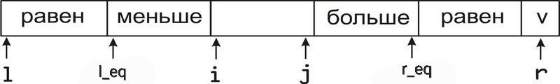

# Модульное программирование

Мы научились делить код на функции, но всё равно огромная куча кода осталась и хочется поделить её на блоки, которые не будут зависеть друг друга. Один из методов такого деления - это модульное программирование. То есть у нас есть функция/набор функций/написанная нами библиотека и мы её хотим отделить от остального кода и просто дергать из неё нужные нам функции. Для этого есть оптимальное решение: разделить все объявления от определений и инклюдить объявления, используемых вещей, в наш рабочий файл. Почему инклюдить не просто определения? Потому что это сильно увеличивает время компиляции программы, так как директива `#include` попросту вставляет весь код из вставленного файла в наш. А без добавления вообще чего-либо наша попытка собрать программу сломается на этапе компиляции.

Также для решения проблемы двойного включения используют "стражей включения"
```
// print.h
#ifndef PRINT_H  // если не определен макрос PRINT_H
#define PRINT_H  // определить макрос PRINT_H
#include <iostream>
void Print(int x) { std::cout << x << '\n'; }
#endif
```
Теперь в одном файле может быть только одна подстановка print.h (остальные не прйдут стражей).
Стражи включений, как правило, вешаются на весь файл целиком.

# Встраиваемые функции/переменные
Встраиваемая функция в C++ - функция, код которой "вставляется" в место вызова функции, а не вызывается. Соответственно это оптимизирует работу программы, если затраты на вызов функции существенны относительно работы функции (например простые действия по типу суммы, проверки на пустоту, знак переменной). Но при этом определение встраиваемой функции должно быть видно в .cpp файле (translation unit) в котором она используется, так как подставляется до линковки. Поэтому её нельзя разделить на .h .cpp файлы. Зато встраиваемые функции могут нарушать ODR и быть определены несколько раз, но идентично, иначе это будет UB. Вообще компиляторы игнорируют `inline` и сами решают какие функции являются встраиваемыми, а какие нет. Так что `inline` используют только для обхода ODR.
```
 inline int Sum(int x, int y) { return x + y; } // так объявляется встраиваемая функция

 inline int my_var = 2; // встраиваемыми можно сделать и глобальные переменные,
// опять же просто для обхода того, что глобальная переменная определяется один раз
```

# Внутреннее и внешнее связывание
```
// Внешнее связывание, это когда переменные/функции объявлённые в данном файле в глобальной области доступны для 
// использования из других файлов указанных при сборке
extern int x = 0;
extern int Sum(int x, int y) { return x + y; } // с extern можно указать это, но не обязательно

int y = 1;
int Max(int x, int y) { return x > y ? x : y; }

// Внутреннее связывание, когда мы запрещаем такой доступ

static int swap_count = 0;

static void Swap(int& x, int& y) {
  ++swap_count;
  // ...
}
```

# Cstring

Обратимся к презентации.

# Быстрая сортировка

Идея алгоритма в том, что выбирается опорный элемент, затем по нему массив делится на две части: <= него, > него и запускается сортировка двух подмассивов снова. Среднее время работы $O(nlogn)$, так как считаем, что массив делится каждый раз примерно пополам, но в определённых случаях время может возрасти до $O(n^2)$.
```
void quicksort(a: T[n], int l, int r)
    if l < r
      int q = partition(a, l, r) // процедура разбиение массива на две части, где под индексом q лежит опорный элемент(pivot)
      quicksort(a, l, q)
      quicksort(a, q + 1, r)
```

На лекции по алгоритмам была рассмотрена быстрая сортировка с разбиением Ломуто (брался опопрным первый элемент) и разбиение Хоара (опорный это $(left + right) / 2$).

Также есть модификации быстрой сортировки по выбору опорного элемента как медианы трёх/пяти/семи значений.

Рассмотрим модификацию быстрой сортировки, где массив разбивается на три кучки (< pivot, = pivot, > pivot).
Как мы это будем делать: берём опорным элементом самый правый, затем проходимся по массиву указателями i, j и меняем местами элементы так, чтобы это удовлетворяло картинке ниже:



Затем перемещаем наши крайние равные кучки в центр и запускаем сортировку от крайних неотсортированных кучек.

```
void QuickSort(int* arr, int64_t left, int64_t right) {
  using std::swap;

  if (left >= right) {
    return;
  }
  int pivot = arr[right];
  int i = left;
  int j = right - 1;
  int left_eq = left - 1;
  int right_eq = right;

  while (i <= j) {
    while (arr[i] < pivot) {
      ++i;
    }
    while (arr[j] > pivot) {
      --j;
    }
    if (i >= j) {
      break;
    }

    swap(arr[i], arr[j]); // перемещаем элементы в их половины <= и >=
    if (arr[i] == pivot) { // распределяем уже внутри этих половин по критерию равенства опорному
      ++left_eq;
      swap(arr[left_eq], arr[i]);
    }
    ++i;

    if (arr[j] == pivot) {
      --right_eq;
      swap(arr[right_eq], arr[j]);
    }
    --j;
  }

  swap(arr[i], arr[right]); // ставим в центр опорный
  j = i - 1; // теперь указывает на правый край кучки <, то есть  arr[j] < pivot если таковые имеются
  ++i; // теперь указывает на  ktdsq край кучки >, то есть  arr[i] > pivot если таковые имеются
  for (int64_t k = left; k <= left_eq; k++, j--) {
    swap(arr[k], arr[j]);
  }
  for (int64_t k = right - 1; k >= right_eq; k--, i++) {
    swap(arr[k], arr[i]);
  }

  QuickSort(arr, left, j);
  QuickSort(arr, i, right);
}
```
